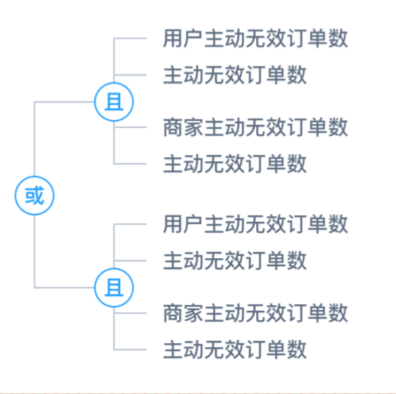

# vue-logic-tree

> 基于vue的一个逻辑展示树组件



## 安装

``` bash
npm i vue-logic-tree
```

## 基本用法

```
<template>
  <logic-tree :data="logicTreeData"></logic-tree>
</template>

<script>
const logicTreeData = {
  "type": "logic",
  "name": "或",
  "children": [
    {
      "type": "logic",
      "name": "且",
      "children": [
        { "type": "text", "name": "用户主动" },
        { "type": "text", "name": "主动无效" },
        { "type": "text", "name": "商家主动无效" },
        { "type": "text", "name": "主动无效订单" }
      ]
    },
    {
      "type": "logic",
      "name": "且",
      "children": [
        { "type": "text", "name": "用户主动" },
        { "type": "text", "name": "主动无效" },
        { "type": "text", "name": "商家主动无效" }
      ]
    }
  ]
}

export default {
  name: 'basic',

  components: {
    LogicTree
  },

  created() {
    this.logicTreeData = logicTreeData
  }
}
</script>
```

## tree-data的结构

每个树的结构要求如下:

```
{
	// 规定节点显示逻辑符号还是具体规则
	// logic 显示逻辑符号
	// text 显示规则
	type: 'logic' | 'text',
	
	// 节点的文字内容
	name: String,
	
	// 子节点数组，可为空
	children: Array(Optional)
}
```

## 自定义节点样式

通过`option`这个props自定义节点样式，具体规则如下：

```
{
	logicCircle: {...} 逻辑值外面的圆的样式
	logicText: {...}   逻辑值样式
	ruleText: {...}    规则的样式
	link: {...}        连接节点的路径的样式
}
```

可以通过如下方式自定义节点样式：

```
<template>
  <logic-tree :data="logicTreeData" :option="option"></logic-tree>
</template>

<script>
const logicTreeData = {
  "type": "logic",
  "name": "或",
  "children": [
    {
      "type": "logic",
      "name": "且",
      "children": [
        { "type": "text", "name": "用户主动" },
        { "type": "text", "name": "主动无效" },
        { "type": "text", "name": "商家主动无效" },
        { "type": "text", "name": "主动无效订单" }
      ]
    },
    {
      "type": "logic",
      "name": "且",
      "children": [
        { "type": "text", "name": "用户主动" },
        { "type": "text", "name": "主动无效" },
        { "type": "text", "name": "商家主动无效" }
      ]
    }
  ]
}


export default {
  name: 'custom',

  components: {
    LogicTree
  },

  created() {
    this.logicTreeData = logicTreeData
    this.option = {
      logicCircle: {
        r: 9
      },
      logicText: {
        stroke: 'steelblue'
      },
      ruleText: {
        'font-size': 14
      },
      link: {
        'stroke-width': 2
      }
    }
  }
}
</script>
```