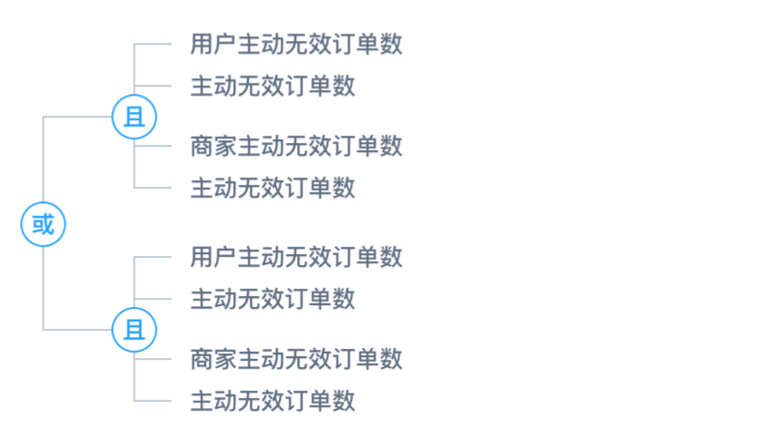

# vue-logic-tree

> 基于vue的一个逻辑展示树组件



## 安装

``` bash
npm i vue-logic-tree
```

## Props

属性 | 类型 | 默认值 | 描述
---- | ---- | ---- |----
width | Number | 250 | 容器宽度
height | Number | 250 | 容器高度
data | Object | - | 数据对象
option | Object | - | 用于自定义样式
text-formatter | Function | - | 用于自定义文本内容

## tree-data的结构

每个树的结构要求如下:

```
{
	// 节点为逻辑符号时存在以下字段
	condition 逻辑类型
	rules 规则数组
	
	// 如果节点为规则，则存在以下字段
	type 字段类型（Number | Text | ...）
	field 字段名称
	operator 比较运算符
	value 字段值
}
```

## 基本用法

```
<template>
  <logic-tree :data="logicTreeData"></logic-tree>
</template>

<script>
const logicTreeData = {
  "condition": "OR",
  "rules": [
    {
      "condition": "AND",
      "rules": [
        { "type": "number", "field": "用户主动无效订单数", "operator": ">", "value": "10" },
        { "type": "number", "field": "主动无效订单数", "operator": "=", "value": "10" },
        { "type": "number", "field": "商家主动无效订单数", "operator": "<", "value": "10" },
        { "type": "number", "field": "主动无效订单数", "operator": "=", "value": "20" }
      ]
    },
    {
      "condition": "AND",
      "rules": [
        { "type": "number", "field": "用户主动无效订单数", "operator": ">", "value": "10" },
        { "type": "number", "field": "主动无效订单数", "operator": "=", "value": "10" },
        { "type": "number", "field": "商家主动无效订单数", "operator": "<", "value": "10" },
        { "type": "number", "field": "主动无效订单数", "operator": "=", "value": "20" }
      ]
    }
  ]
}

export default {
  name: 'basic',

  components: {
    LogicTree
  },

  created() {
    this.logicTreeData = logicTreeData
  }
}
</script>
```

## 自定义节点样式

通过 `option` 这个props自定义节点 `style` ，具体规则如下：

```
{
	logicCircle: {...} 逻辑值外面的圆的样式
	logicText: {...}   逻辑值样式
	ruleText: {...}    规则的样式
	link: {...}        连接节点的路径的样式
}
```

可以通过如下方式自定义节点样式：

```
<template>
  <logic-tree :data="logicTreeData" :option="option"></logic-tree>
</template>

<script>
const logicTreeData = {
  "type": "logic",
  "name": "或",
  "children": [
    {
      "type": "logic",
      "name": "且",
      "children": [
        { "type": "text", "name": "用户主动" },
        { "type": "text", "name": "主动无效" },
        { "type": "text", "name": "商家主动无效" },
        { "type": "text", "name": "主动无效订单" }
      ]
    },
    {
      "type": "logic",
      "name": "且",
      "children": [
        { "type": "text", "name": "用户主动" },
        { "type": "text", "name": "主动无效" },
        { "type": "text", "name": "商家主动无效" }
      ]
    }
  ]
}


export default {
  name: 'custom-style',

  components: {
    LogicTree
  },

  created() {
    this.logicTreeData = logicTreeData
    this.option = {
      logicCircle: {
        r: 9
      },
      logicText: {
        stroke: 'steelblue'
      },
      ruleText: {
        'font-size': 14
      },
      link: {
        'stroke-width': 2
      }
    }
  }
}
</script>
```

## 自定义节点显示文本

通过 `text-formatter` 属性向组件传递一个函数，参数是传入的数据对象 `{ condition: xxx, rules: [xxx] }` ，如果定义了该函数，则使用该函数的返回值作为每个文本的值

```
<template>
  <logic-tree :data="logicTreeData" :text-formatter="d => d.condition || d.field"></logic-tree>
</template>

<script>
const logicTreeData = {
  "type": "logic",
  "name": "或",
  "children": [
    {
      "type": "logic",
      "name": "且",
      "children": [
        { "type": "text", "name": "用户主动" },
        { "type": "text", "name": "主动无效" },
        { "type": "text", "name": "商家主动无效" },
        { "type": "text", "name": "主动无效订单" }
      ]
    },
    {
      "type": "logic",
      "name": "且",
      "children": [
        { "type": "text", "name": "用户主动" },
        { "type": "text", "name": "主动无效" },
        { "type": "text", "name": "商家主动无效" }
      ]
    }
  ]
}


export default {
  name: 'custom-text',

  components: {
    LogicTree
  },

  created() {
    this.logicTreeData = logicTreeData
  }
}
</script>
```